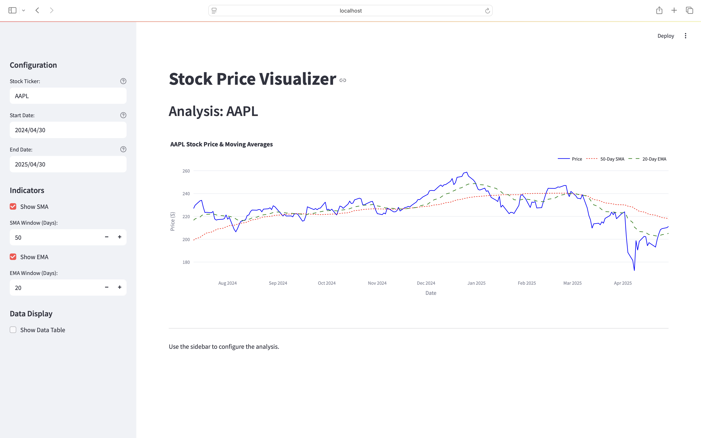

# Streamlit Stock Price Visualizer

A simple web application built with Streamlit to visualize historical stock prices, Simple Moving Averages (SMA), and Exponential Moving Averages (EMA).

Data is fetched from Yahoo Finance using the `yfinance` library, and charts are rendered using Plotly.

## Screenshot

*(Optional: Add a screenshot of the running app here)*


## Setup

1.  **Prerequisites:**
    *   Python 3.7+

2.  **Clone or Download:**
    *   Get the project files (`stock_app.py`, `data_fetcher.py`, `calculations.py`, `plotting.py`, `requirements.txt`).

3.  **Navigate to Directory:**
    *   Open your terminal or command prompt and `cd` into the project folder.

4.  **Create Virtual Environment (Recommended):**
    ```bash
    python -m venv venv
    # Activate it:
    # Windows: .\venv\Scripts\activate
    # macOS/Linux: source venv/bin/activate
    ```

5.  **Install Dependencies:**
    ```bash
    pip install -r requirements.txt
    ```

## Usage

1.  Make sure your virtual environment is activated (if you created one).
2.  Run the Streamlit application from the project directory:
    ```bash
    streamlit run stock_app.py
    ```
3.  The application should automatically open in your web browser. Use the sidebar to configure the inputs.

## File Structure

*   `stock_app.py`: Main Streamlit application file (UI & control flow).
*   `data_fetcher.py`: Fetches data from Yahoo Finance.
*   `calculations.py`: Calculates technical indicators.
*   `plotting.py`: Creates the Plotly chart.
*   `requirements.txt`: Lists Python package dependencies.